Here is a focused review of the path from **manifesto** compile through **puter** execution, with emphasis on fusion and JIT.

## Pipeline (what is actually wired)

`CompileAssets` does: lower YAML → `typer.Run` → `optimizer.Run` (constant fold, rewrite, **fuse**, tile) → optional re-typer → **`codegen.AttachKernels`** → validate → DAG → **`PlanGraph`** → `ir.Topology` workspaces.

```67:83:/Users/theapemachine/go/src/github.com/theapemachine/manifesto/compiler/graph_pipeline.go
	if !options.SkipOptimizer {
		if _, err := optimizer.Run(graph, options.OptimizerOptions); err != nil {
			return nil, err
		}
		// ...
	}

	if !options.SkipCodegen {
		if _, err := codegen.AttachKernels(graph, options.CodegenOptions); err != nil {
			return nil, err
		}
	}
```

Elementwise fusion is real on the **ast.Graph**: `optimizer.Fuse` replaces chains/trees with `optimizer.fusion` nodes carrying a `FusionAST`, then codegen attaches a `KernelSet` on each fused node. **puter**'s dispatcher runs those via `runFusedNode` / `runCompiledFusedNode`.

That is separate from **`puter/fusion`'s catalog** (matmul+bias+gelu, layernorm+residual, etc.), which is documented but **not hooked into manifesto's compiler or caramba's graph pass** — only referenced from XLA tests today. So you effectively have **two fusion stories**, only one of which runs in production.

> **Solution:** Delete the standalone orchestrator fusion pass. Move `puter/fusion/catalog.go` entries into `manifesto/optimizer/catalog.go` and add an `optimizer.FuseCatalog(graph)` pass that runs immediately after `optimizer.Rewrite` and before `optimizer.Fuse`. The pass replaces exact `SourceOps` sequences with a single graph node whose `Op` is the catalog `FusedOp` string bound to the matching `device.Backend` method via the operation registry. Parity tests live under `manifesto/optimizer/catalog_parity_test.go` and `puter/device/...` for each fused primitive. Remove `caramba/pkg/backend/compute/fusion` duplication once the manifesto pass is the sole matcher.

---

## Concerning (performance / contract)

### 1. Duplicate / divergent fusion IR

- **Live path:** `optimizer.FusionAST` on fused `ast.GraphNode` attributes.
- **Parallel path:** `ir.FindFusionClusters` + `ir.FusionAST` + `Node.JitKernel` — **not populated by `AttachKernels` or `CompileGraph`**; only tests reference it.

Risk: future work attaches JIT to `ir.Node` while execution still reads `ast` attributes, or two clusterers drift.

> **Solution:** Delete `manifesto/ir/fusion.go`, `ir.FindFusionClusters`, `ir.FusionAST`, `ir.FusionNodeType`, and `ir/fusion_test.go`. Keep exactly one fusion AST type: `optimizer.FusionAST`. In `compiler/graph_pipeline.go`, after `codegen.AttachKernels` and before `BuildDAGFromGraph`, add `compiler.TransferCompiledKernels(graph, workspaces)` that walks every `optimizer.FuseOp` node, reads `node.Attributes[codegen.KernelAttribute]`, and writes the device-executable handle for the active target into `ir.Node.JitKernel` on the corresponding planned node (matched by `node.ID`). Delete `optimizer.FuseAttributeAST` from the execution hot path: `puter/execution` resolves fused ops only through `ir.Topology` nodes and `JitKernel`, never through `ast.GraphNode.Attributes`. Update `ir/node.go` comments to state `JitKernel` is mandatory for every `optimizer.fusion` node after compile.

### 2. Metal JIT: compile twice, use the second path

At compile time, Darwin+cgo does `EmitMetalRunner` → `metalcodegen.EmitKernel` → **MTLLibrary compile**.

At runtime, `tryRunFusedOnMetalDevice` ignores the compiled handle and only uses `MSLSource()` + `MSLKernelName()`, then `fusion.Cache.Program` → **`ensureCompiled` compiles MSL again** on first dispatch per context.

So attach-time Metal compile is largely **redundant work**; first real dispatch can still pay compile latency (mitigated by cache keyed on source+name).

> **Solution:** Store the attach-time `metalcodegen.CompiledKernel` native program handle inside `codegen.KernelSet` under `TargetMetal` as an opaque `uintptr` transferred to `ir.Node.JitKernel`. Change `puter/execution/dispatch_fused_device_darwin.go` to call `fusion.ProgramFromHandle(JitKernel)` and `Program.Dispatch` directly. Remove `MetalFusionProgram`, `MSLSource()`, `MSLKernelName()`, and `fusion.Cache.Program(source, kernelName)` from the production dispatch path. Delete `ensureCompiled` recompilation from source string on the hot path; retain MSL text generation only in parity tests under `manifesto/codegen/metal_*_test.go`. Compile exactly once per fused subgraph per session at `AttachKernels` time.

### 3. Fused execution still has a host-sync escape hatch

Metal device path: `pointerOf` → `BufferRefFromDispatch` — good when tensors implement `DispatchPointer`.

CPU / fallback fused path in `runFusedNodeWithSlots`: **`Float32Native()`** on every input and output, then `runner.Run([][]float32, …)`. That is explicit host materialization and violates the zero-host-sync goal for anything that hits that branch (non-Metal, or Metal tensors without buffer refs → falls through).

> **Solution:** Delete the `Float32Native` branch from `runFusedNodeWithSlots` and from `pointerOf` when the caller is fused dispatch. Fused execution requires every input and output tensor to implement `DispatchPointer` pointing at workspace-resident storage allocated by `AttachWorkspace`. Return a hard error (`execution: fused node %q: tensor %q is not device-resident`) when `DispatchPointer` is missing or `BufferRefFromDispatch` returns zero. Replace `codegen.ElementwiseRunner.Run([][]float32, …)` with `RunDevice(dst unsafe.Pointer, inputs []unsafe.Pointer, count int, format dtype.DType)` on CPU LLVM JIT and Metal kernels alike. Remove `codegen/metal/compile_darwin.go` `metal_fusion_jit_run_host` from non-test builds.

### 4. Fused kernels are effectively **float32-only**

MSL codegen hardcodes `float` buffers; `ElementwiseRunner` is `[][]float32`. `FusionAST.DType` / graph `ExecutionDType` are not driving codegen. If the manifest runs fp16/bf16, fused subgraphs either do not participate or silently disagree with the dtype contract unless something upstream forbids fusion for those graphs.

> **Solution:** Set `optimizer.FusionAST.DType` from `graph.ExecutionDType` in `optimizer.Fuse` and reject fusion codegen when `DType` is not in the closed set `{Float32, Float16, BFloat16}` with a compile error. Generate separate MSL and LLVM modules per dtype (`half`, `bfloat`, `float` buffer types; matching LLVM element types). Replace `ElementwiseRunner` with the device signature above parameterized by `format dtype.DType`. Add parity tests at N ∈ {1, 7, 64, 1024, 8192} per supported dtype against the scalar reference for each fused pattern. Do not fuse subgraphs whose ports unify to a dtype without a completed codegen backend for that dtype.

### 5. LLVM CPU JIT is optional, not the default product build

Without `-tags=codegen_llvm`, `EmitCPU` is the **scalar reference walker** in Go — correct for parity, not for performance. With the tag, JIT is attached at compile time (good), but the same **float32 slice** runner interface applies when the fused path does not use device pointers.

GAPS.md already marks GPU JIT and CPU vector transcendental work as partial; that matches the code.

> **Solution:** Make `codegen/emit_cpu_jit.go` the sole `EmitCPU` implementation in all non-test builds: delete `emit_cpu_ref.go` and the `!codegen_llvm` build split. Move `EmitReferenceCPU` to `codegen/reference_test.go` (test-only import path) for parity harnesses. `AttachKernels` must call `llvm.EmitKernel` with `HostISALevel()` vector loops at O3 for every fused node. CI runs `go test -tags=codegen_llvm` on amd64 and arm64. Update `scripts/check_banned.sh` to fail if `EmitCPU` lowers to a Go AST interpreter outside `_test.go` files.

### 6. Cache tiling is a no-op downstream

`optimizer.Tile` writes `cache_tiling` / `TileConfig` on matmul/conv nodes. **Nothing outside optimizer tests reads it** — no codegen, no puter dispatch, no tiled kernel selection. Metadata without a consumer.

> **Solution:** During `compiler.TransferCompiledKernels` (or a dedicated `compiler.TransferTileConfig` in the same hook), copy `optimizer.TileAttribute` into `ir.Node` metadata consumed by puter. Extend `OperationBind` in `puter/execution/operation_bind.go` to read `TileConfig` and pass `device.MatmulTileConfig` / `device.Conv2DTileConfig` into `device.Backend.Matmul` and `Conv2D`. Implement tiled dispatch in `device/cpu/matmul` and `device/metal/matmul` (and convolution analogs) for every dtype and ISA tier. Add `*_tiled_parity_test.go` proving tiled vs untiled match within tight ULP bounds at N ∈ {1, 7, 64, 1024, 8192}. Do not remove the `optimizer.Tile` pass.

### 7. Hot-path maps (partially improved)

**Good:** `compileExecutionProgram` pre-binds ops and slots; fused/assign/bound nodes avoid per-step `registry.Bind` when `program != nil`.

**Still there:** `operationRegistry.operations[node.Op]` at compile time; `valueTable` / graph paths; manifesto `runtime.Executor` still map-heavy for program control (separate from puter's device loop).

> **Solution:** Delete `dispatcher.runNode` and the graph-walk dispatch path from production `puter/execution/dispatch.go`; `runLayers` must require `executionProgram != nil` and return an error otherwise. Extend `compileExecutionProgram` to emit a `[]compiledNode` indexed by planner node ordinal (dense slice, no `map[string]*ast.GraphNode` at run time). Replace `valueTable` name lookups on the hot path with slot indices only; `map[string]int` exists solely at compile time when building the program. Pre-resolve fused nodes to `{inputSlots, outputSlot, jitKernel uintptr}` in `compiledNode` so fused dispatch never touches `ast.GraphNode.Attributes`.

### 8. No CUDA / PTX / XLA lowering for `FusionAST`

`codegen.EmitFusion` only handles `TargetCPU` and `TargetMetal`. ARCHITECTURE.md's "one AST, all backends" is not true yet for fused elementwise on GPU beyond Metal (and Metal only on Darwin+cgo).

> **Solution:** Add `TargetCUDA` and `TargetXLA` to `codegen.Target` and implement `codegen/cuda.EmitKernel` (NVRTC → CUfunction) and `codegen/xla.EmitKernel` (HLO fusion module per subgraph) using the same `optimizer.FusionAST` walk as Metal and LLVM. `AttachKernels` emits all five targets every compile; `KernelSet` stores each handle. `TransferCompiledKernels` selects the handle matching the session `tensor.Location`. Parity vs scalar reference is mandatory per target and dtype before the target is considered implemented. Update `device/cuda` and `device/xla` fused dispatch mirrors of `dispatch_fused_device_darwin.go`.

---

## Concerning (correctness / design drift)

| Issue | Why it matters |
|--------|----------------|
| **Heavy-op fusion catalog unused** | `puter/fusion` describes transformer fusions with parity bounds; compiler never applies them — matmul+gelu still go through separate static kernels unless you hand-fuse in YAML (you cannot). |
| **`runtime.Pinner` in manifesto metal test JIT** | `codegen/metal/compile_darwin.go` host-run path pins slices — fine for tests; must not leak into async device callbacks (device dispatch path does not use it). |
| **Singleton fusion clusters** | `ir.FindFusionClusters` (and optimizer behavior) can fuse single ops "for JIT benefit" — on CPU default that can be **slower** than calling a tuned static `device.Backend` kernel (ReLU, Gelu, etc.). |
| **Typer runs twice around optimizer** | Intentional after rewrites; cost is compile-time only, but failures here are easy to misread. |

### Heavy-op fusion catalog unused

> **Solution:** Same as the pipeline solution above: `optimizer.FuseCatalog` is the only catalog matcher; it runs in `optimizer.Run` before elementwise `Fuse`. Each catalog entry registers a manifest `template/operation/<family>/<fused_op>.yml` and a `device.Backend` method. Delete unused references to `puter/fusion` from non-test code after the move. `scripts/check_banned.sh` in manifesto requires a `catalog_parity_test.go` row per catalog entry.

### `runtime.Pinner` in manifesto metal test JIT

> **Solution:** Delete `jitRunner.run` and `metal_fusion_jit_run_host` from `manifesto/codegen/metal/compile_darwin.go`. Metal fusion parity tests allocate device buffers through `manifesto/codegen/internal/parity` harness and dispatch via `CompiledKernel` device path only. Add `scripts/check_banned.sh` rule: `runtime.Pinner` is forbidden under `manifesto/codegen/` except `_test.go` files.

### Singleton fusion clusters

> **Solution:** Change `optimizer.Fuse` to skip any cluster where `cluster.size() <= 1` (remove the current early-continue that still allows singleton JIT). Elementwise ops with one node remain ordinary atomic ops dispatched to static `device.Backend` kernels. Update fusion tests to expect no `optimizer.fusion` node for a lone `math.relu`.

### Typer runs twice around optimizer

> **Solution:** Keep both `typer.Run` invocations in `CompileGraph` permanently: the first establishes types before rewrite/fuse; the second re-unifies port types after graph mutation. Add `compiler/graph_pipeline_test.go` assertion that fails if the second run is removed. Document the invariant in a one-line comment above the second call: `// Re-unify after optimizer mutates nodes and port types.`

---

## What is *not* concerning (or is intentional partial state)

- **`layernorm.Host`-style indirection** in Metal families: same as before — not on the fused hot path; static ops use precompiled `device.Backend` methods.
- **Optimizer fusion rules** (single-consumer, no graph outputs absorbed): align with ARCHITECTURE.md; SwiGLU/residual patterns are covered in tests.
- **Workspace planner + `AttachWorkspace`**: real integration in puter execution; offsets/slots pre-resolved for graph calls — this is the right direction vs per-node `make([]byte)`.
- **GAPS.md P1 item 6**: documents exactly this partial fusion/JIT state; the review above is consistent with that inventory, not a surprise regression.

---

## Fusion vs JIT — mental model

```mermaid
flowchart LR
  YAML --> Lower --> Typer --> Optimizer
  Optimizer --> FuseCatalog["FuseCatalog → fused primitives"]
  FuseCatalog --> Fuse["Fuse → FusionAST"]
  Fuse --> Codegen["AttachKernels → all targets"]
  Codegen --> Transfer["TransferCompiledKernels → ir.Node.JitKernel"]
  Transfer --> Planner --> IR["ir.Topology workspace"]
  IR --> Puter["puter dispatcher → JitKernel + slots only"]
  Puter --> Device["device buffers only, dtype-templated JIT"]
```



**Elementwise fusion + JIT** = manifesto optimizer + multi-target codegen + `ir.Node.JitKernel` + puter device-resident dispatch.

**Catalog fusion** = `optimizer.FuseCatalog` over the same compile pipeline, parity-tested per entry.

---

## Implementation order (mandatory sequence)

1. Delete duplicate `ir` fusion types; add `TransferCompiledKernels` and fused dispatch via `JitKernel` only.
2. Enforce `cluster.size() >= 2` in `optimizer.Fuse`.
3. Dtype-templated codegen + `RunDevice`; remove `Float32Native` and host Metal JIT from fused paths.
4. Metal: single compile at attach; dispatch via stored handle.
5. Make LLVM `EmitCPU` the only production CPU fused emitter.
6. Wire `TileConfig` into matmul/conv device dispatch.
7. Add CUDA and XLA `EmitKernel` + device fused dispatch.
8. Move `puter/fusion` catalog into `optimizer.FuseCatalog` and delete the duplicate orchestrator path.

Close each step in `../puter/GAPS.md` with pasted `make verify` output before starting the next.
