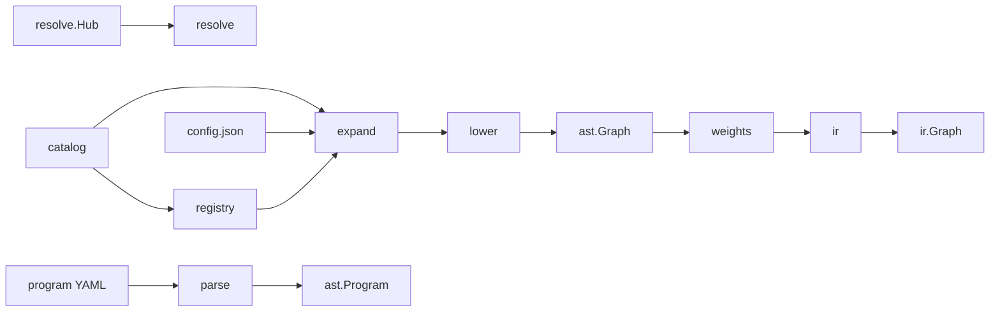

# manifesto

`github.com/theapemachine/manifesto` compiles Hugging Face model repositories and YAML runtime programs into manifest graph IR, compute IR, and bound weights.

The **`compiler`** package (`import "github.com/theapemachine/manifesto/compiler"`) exposes `Compiler` as the compilation entry point; callers supply a recipe catalog and a Hugging Face Hub client.

## Compilation pipeline

When you compile with a Hub repo attached, work flows through these stages:



1. **resolve** — Discover `model_index.json`, per-component `config.json`, execution dtype, and SafeTensors paths.
2. **registry** — Map the Hugging Face architecture class name to a catalog recipe.
3. **expand** — Merge recipe `extends` chains, interpolate config variables, unroll repeats into a concrete topology.
4. **lower** — Infer shapes and lower topology AST into manifest graph IR (`ast.Graph`).
5. **weights** — Index and bind checkpoint tensors onto graph nodes via the recipe weight map.
6. **ir** — Lower manifest graph IR into compute IR (`ir.Graph`) for kernel dispatch.

Parsing a program manifest alone (no repo) stops after **parse** and returns `ast.Program` without model graphs.

## Quick start

```go
import (
    "context"

    "github.com/theapemachine/manifesto/compiler"
    "github.com/theapemachine/manifesto/catalog"
    "github.com/theapemachine/manifesto/resolve"
)

manifestCompiler, err := compiler.NewCompiler(compiler.Options{
    Catalog: catalog.NewFS(yourRecipeFS),
    Hub:     yourHubClient, // implements resolve.Hub
})
if err != nil { /* ... */ }

out, err := manifestCompiler.Compile(ctx, compiler.CompileInput{
    ProgramYAML: programBytes,
    Repo: resolve.RepoLocation{
        RepoID:   "org/model",
        Revision: "main",
    },
    CacheDir: "/tmp/hf-cache",
})
// out.Program, out.Model, out.Graphs, out.ComputeGraphs
```

`resolve.Hub` is host-provided (HTTP, local cache, tests). `catalog.Catalog` is typically an `io/fs.FS` of recipe YAML under `model/architecture/`.

## Sub-packages

### [`compiler`](./compiler/)

Orchestrates the pipeline above. Types: `Compiler`, `CompileInput`, `CompileOutput`. Include expansion and asset graph compilation live in `includes.go` and `assets.go`.

### [`ast`](./ast/)

Typed IR for the compiler and runtime:

- **Recipe / topology** — Block graphs, extends, weight maps, variable bindings
- **Graph** — Manifest-native compute IR (`Graph`, `GraphNode`, bound weights)
- **Program** — Runtime manifest: steps, loops, graph modules, schedulers, state

### [`catalog`](./catalog/)

Loads recipes, reusable blocks, and the architecture registry from an `io/fs.FS`. Hosts embed templates or mount an on-disk tree; `registry.yml` maps Hugging Face class names to recipe files.

### [`parse`](./parse/)

YAML loading for program manifests: includes, variables, `main` / `system.runtime` steps, and graph module definitions. Produces `ast.Program`.

### [`expand`](./expand/)

Materializes a recipe against a Hugging Face `config.json`:

- Merges `extends` chains from the catalog
- Variable interpolation and binding
- Repeat unrolling into a flat `ast.Topology`

### [`registry`](./registry/)

Looks up `ast.RegistryEntry` and loads the matching `ast.Recipe` for a resolved architecture class name.

### [`resolve`](./resolve/)

Hub-facing discovery: pipeline layout from `model_index.json`, component configs, execution dtype, primary SafeTensors file, and file open/read helpers. Defines `Hub`, `RepoLocation`, and download types.

### [`lower`](./lower/)

Shape inference and lowering from `ast.Topology` to `ast.Graph`, using the execution dtype from config.

### [`ir`](./ir/)

Lowers `ast.Graph` to compute IR (`ir.Graph`, `ir.Node`) with `tensor.Shape` on value types. Also provides operation IDs, required-op validation, and graph codec helpers.

### [`weights`](./weights/)

SafeTensors header indexing and binding checkpoint tensors to graph nodes according to the recipe weight map.

### [`runtime`](./runtime/)

Executes `ast.Program` steps against a `Backend` interface (`graph.call` and related ops). Device backends implement `Backend` outside this module.

### [`hfmodular`](./hfmodular/)

Transpiler stub for Hugging Face `modular_*.py` → recipe YAML. API is in place; transpilation is not implemented yet.

### [`dtype`](./dtype/)

Canonical numeric formats for the platform: `DType` enum, scalars, `Float16`, `BFloat16`, FP8, packed `Int4` and `Bool`. Wire format is little-endian everywhere.

### [`dtype/convert`](./dtype/convert/)

Scalar correctness paths for converting between dtypes (used before device upload when a backend does not accept a source dtype natively).

### [`tensor`](./tensor/)

Backend-neutral tensor abstraction: `Tensor` and `Backend` interfaces, host backend, tiered allocation (slab / mmap), NUMA hooks, arenas, sparse CSR, autograd tape types. See [`tensor/README.md`](./tensor/README.md) for allocator and lifecycle detail.

## Runtime execution

After compile, `runtime.Executor` walks program steps and delegates graph execution to your `runtime.Backend`. The compiler output’s `ComputeGraphs` map is what a production backend would schedule; wiring that backend is host-specific.

## Tests

```bash
go test ./...
```

Sub-packages use [GoConvey](https://github.com/smartystreets/goconvey) in several test files.

## Requirements

Go 1.26+ (`go.mod`).
